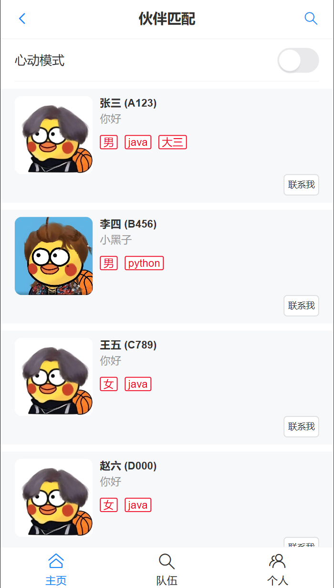
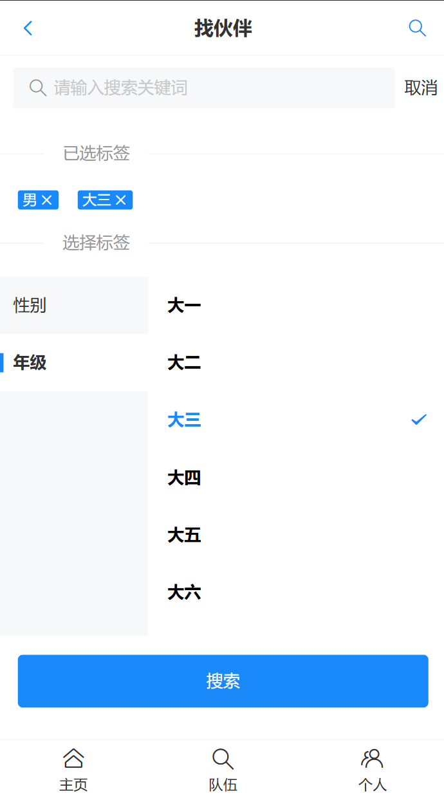
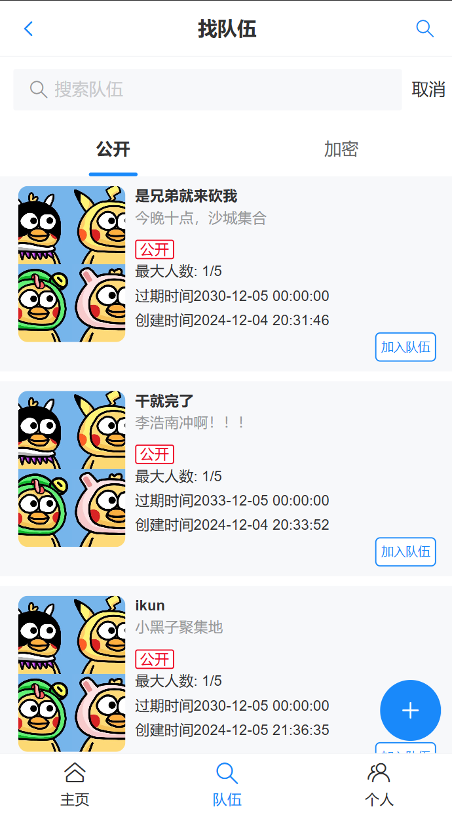
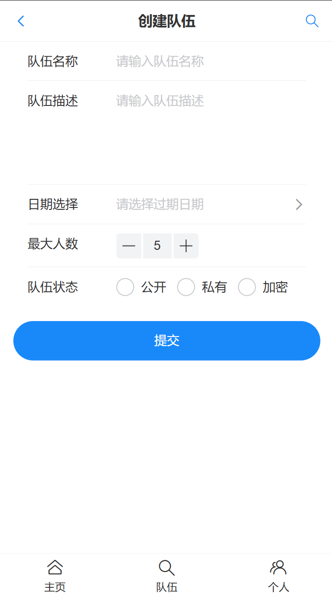
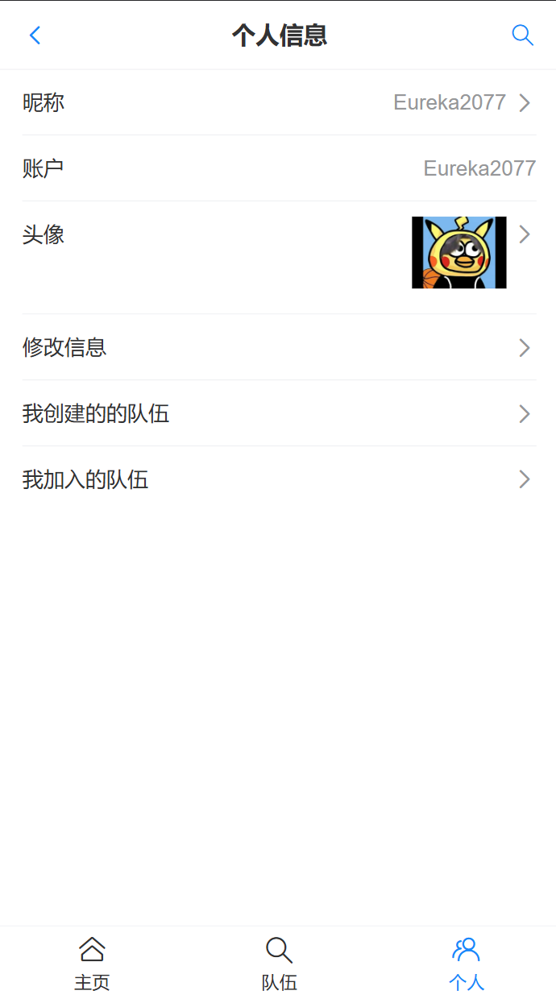
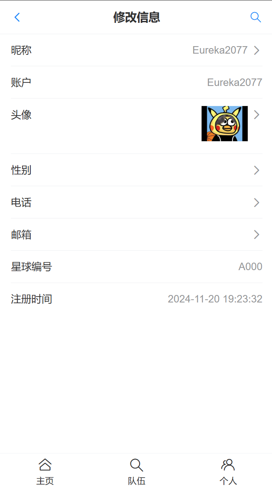
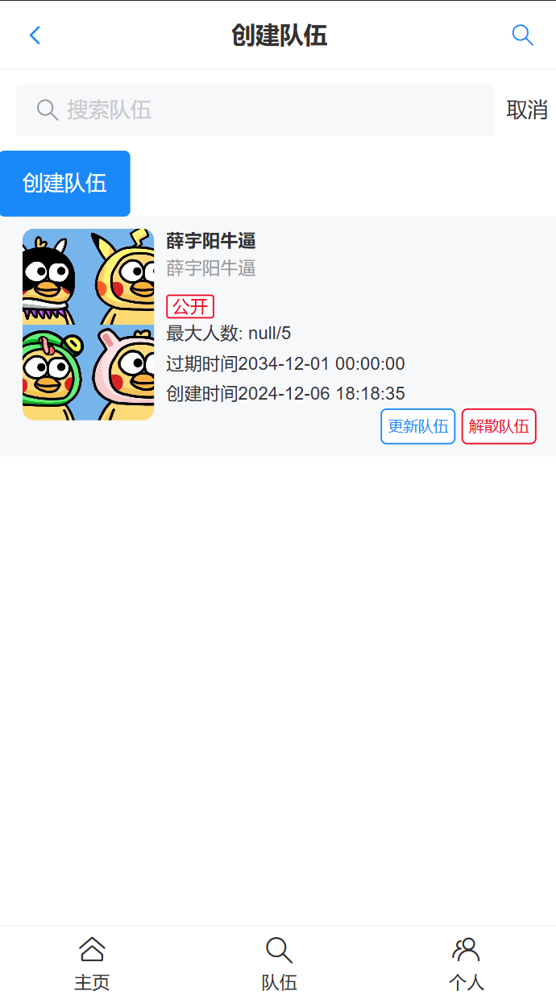

# 伙伴匹配系统

## 项目介绍

帮助大家找到学习伙伴的移动端H5网站（APP风格），基于Springboot后端+Vue3前端的全栈项目

包括用户登录、更新个人信息、按标签搜索用户、建房组队、推荐相似用户等功能。

## 项目特点

该项目基本覆盖企业开发的常见需求以及对应的解决方案

比如用户登录、批量数据导入、信息检索展示、定时任务、资源抢占等

并且涵盖了分布式、并发编程、锁、事务、缓存、性能优化、幂等性、数据一致性、大数据、算法等知识与实践

## 项目展示

### 主页：

### 找伙伴：

### 组队功能：

### 创建队伍：

### 个人信息及修改：

## 技术选型

### 前端

* Vue3
* Vant UI组件库
* Vite 脚手架
* Axios请求库

### 后端

* Java SpringBoot 框架
* MySQL 数据库
* Mybatis-Plus
* Mybatis X 自动生成代码
* Redis缓存（多种Java实现方式）
* Redis 分布式登录
* Redisson 分布式锁
* Easy Excel 数据导入
* Spring Scheduler 定时任务
* Swagger + Knife4j 接口文档
* Gson: JSON 序列化库
* 相似度匹配算法

### 部署

* Serverless服务
* 云原生容器平台